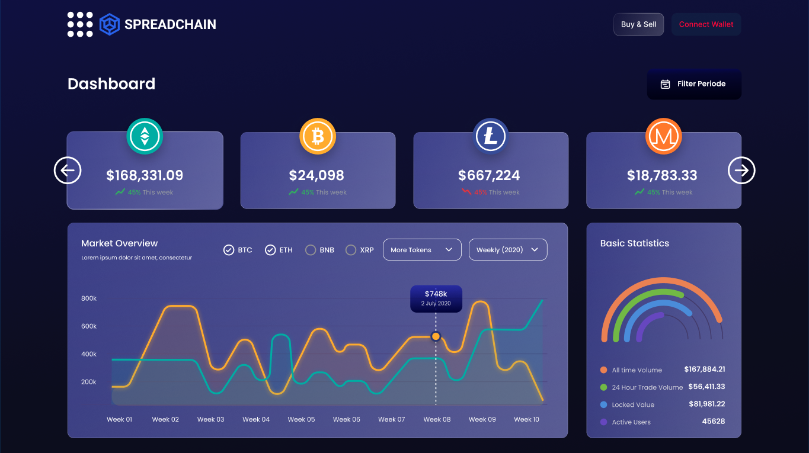
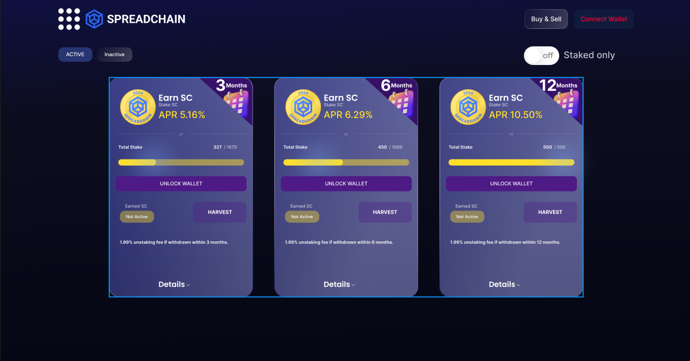
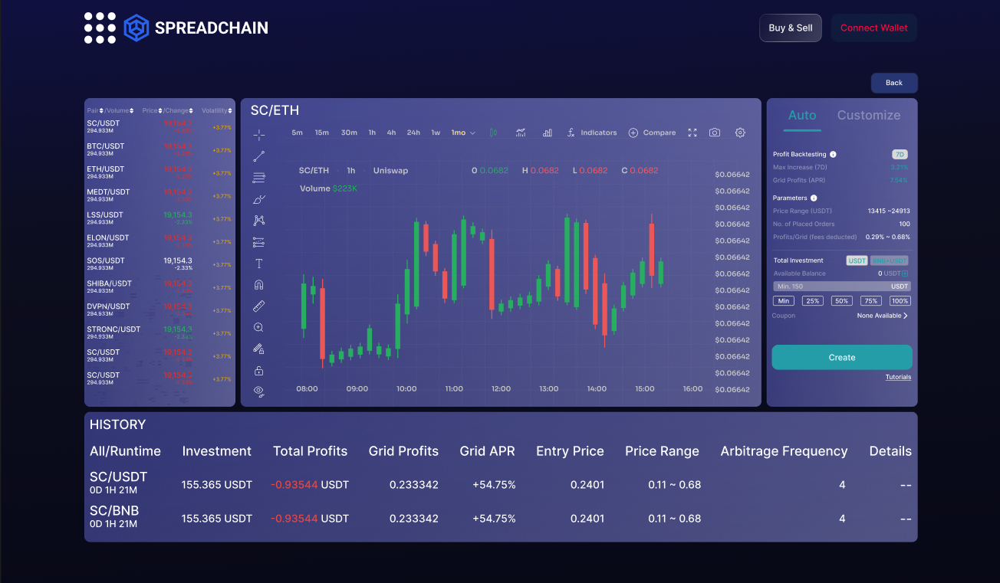
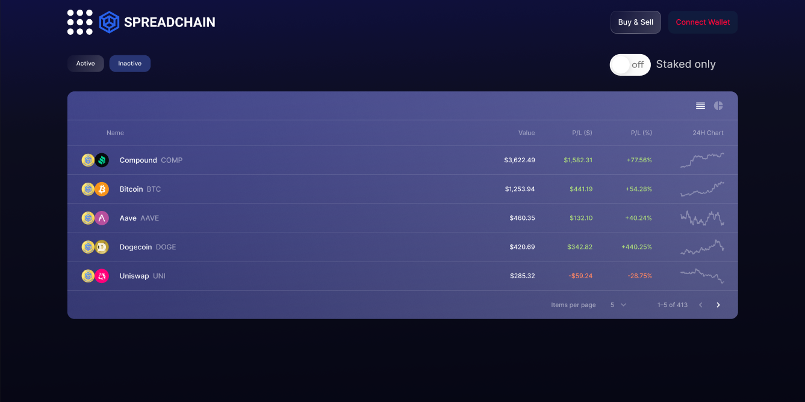

<p align="center">
  
  <span style="font-size: 1.8em; font-weight: bold; vertical-align: middle;">SpreadChain Marketplace (MVP)</span>
</p>


SpreadChain is a decentralized Web3 NFT marketplace built to empower creators, collectors, and gamers to seamlessly buy, sell, trade, and manage NFTs and game tokens across multiple blockchain networks.






---

##  Project Overview

SpreadChain is designed to deliver a secure, scalable, and intuitive experience in the rapidly growing NFT and Web3 ecosystem. Built with modern blockchain and web technologies, our MVP version demonstrates the platform’s core capabilities and vision.

###  Core Features (MVP)

-  Mint, list, buy, and sell NFTs
-  Wallet integration (MetaMask & WalletConnect)
-  On-chain metadata display
-  Smart contract interaction via Web3.js / Ethers.js
-  Support for game tokens and assets
-  Secure and gas-efficient smart contracts

---

##  Tech Stack

| Layer        | Stack                                  |
|--------------|----------------------------------------|
| **Frontend** | React.js, TypeScript, Tailwind CSS     |
| **Backend**  | Node.js, Express.js, REST APIs         |
| **Blockchain** | Ethereum (Solidity), Ethers.js/Web3.js |
| **Storage**  | IPFS, NFT metadata                     |
| **Design**   | Figma (UI/UX finalized)                |

---

##  Getting Started

### Prerequisites

- Node.js >= 16.x
- NPM >= 8.x
- MetaMask browser extension

### Install Dependencies

```bash
npm install
```

### Run Locally

```bash
npm start
```

Visit: `http://localhost:8081`

### Development Notes


- Smart contracts are deployed on Polygon Mumbai Testnet (note: deprecated as of April 2024 — migration in progress).
- Integration with updated networks is planned for the next release.
- Backend endpoints provide NFT metadata and user account history.

